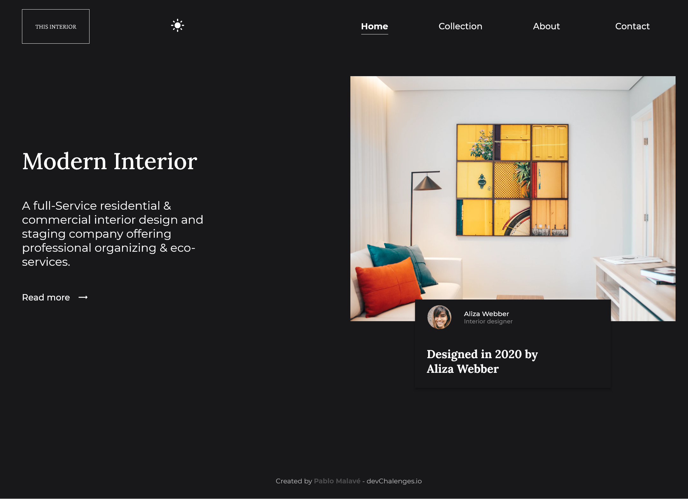
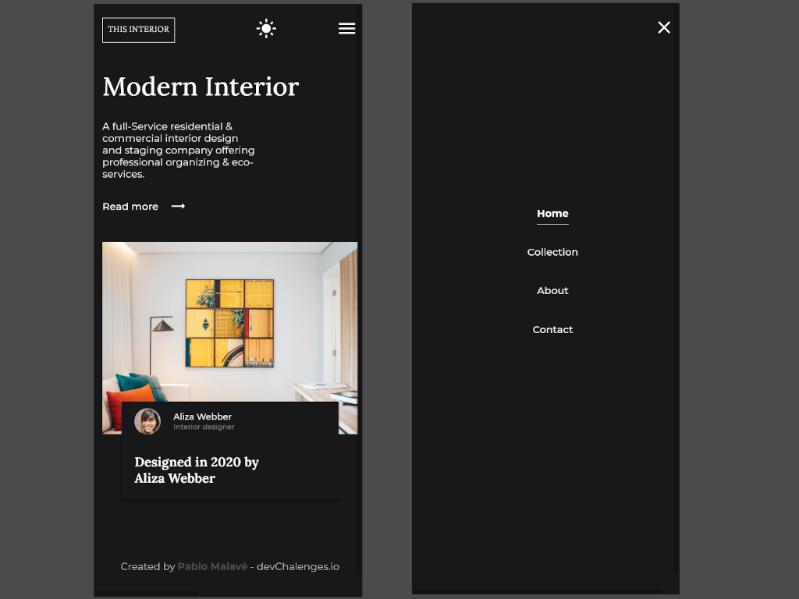
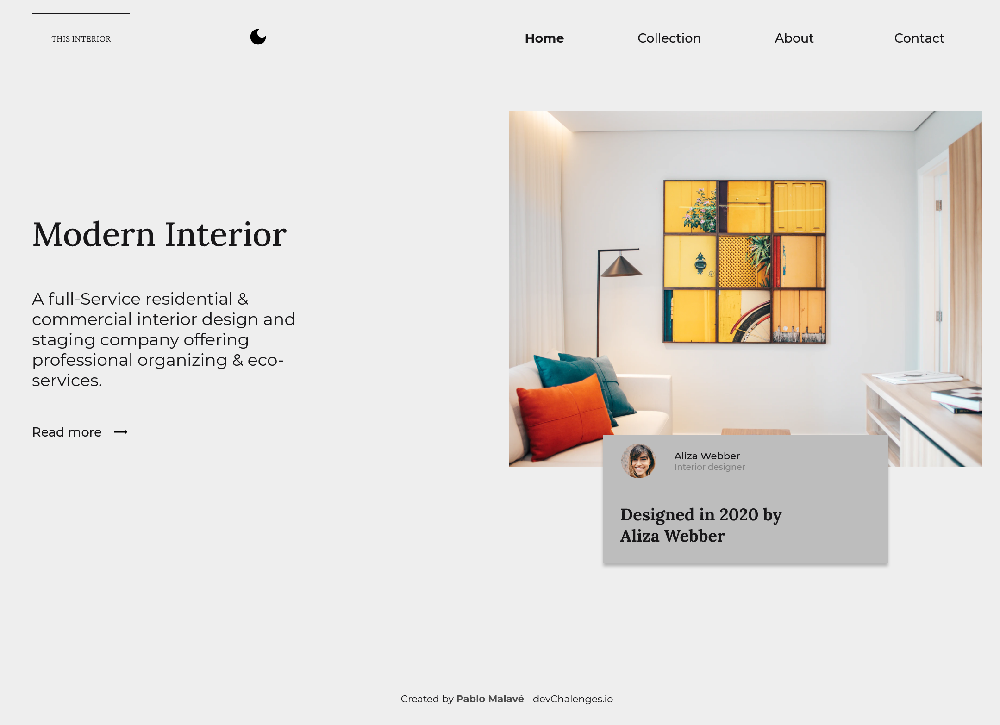
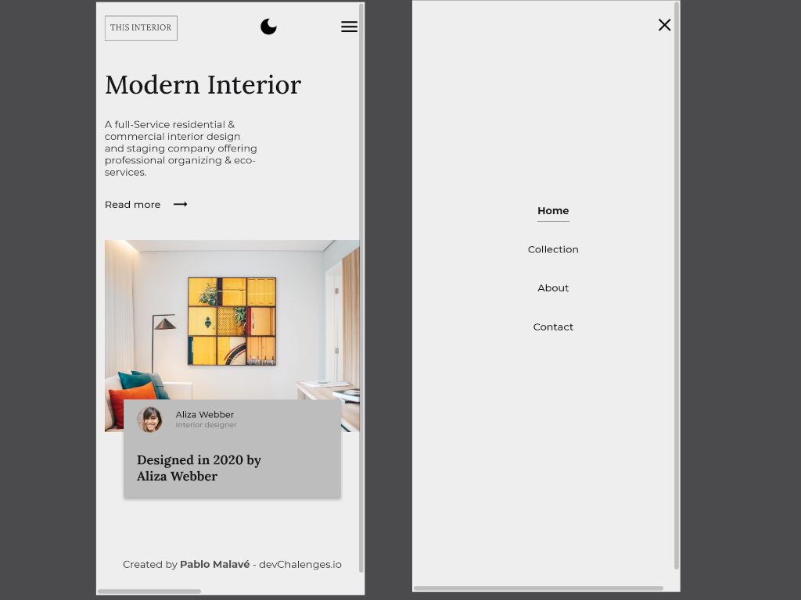

<!-- Please update value in the {}  -->

<h1 align="center">Interior Consultant</h1>

   Solution for a challenge from  <a href="http://devchallenges.io" target="_blank">Devchallenges.io</a>.

  <h3>
    <a href="https://03-interior-consultant-master.vercel.app/">
      Demo
    </a>
     | 
    <a href="https://github.com/pablomalave/03.interior-consultant-master.git">
      Solution
    </a>
     | 
    <a href="https://devchallenges.io/challenges/Jymh2b2FyebRTUljkNcb">
      Challenge
    </a>
  </h3>

<!-- TABLE OF CONTENTS -->

## Table of Contents

- [Overview](#overview)
  - [Built With](#built-with)
- [Features](#features)
- [Contact](#contact)
- [Acknowledgements](#acknowledgements)

<!-- OVERVIEW -->

## Overview

Web page that shows a model of a room or some interior space of a house or office.

- The image of the design is accompanied by the name and photo of its author.
- In the mobile size of the page, the horizontal navigation menu is replaced by a drop-down menu through a button.
- The page has a light mode and a button to exchange it for the dark mode.

### Built With

<!-- This section should list any major frameworks that you built your project using. Here are a few examples.-->

- HTML, CSS, CSS Grid, CSS Flex.
- JavaScript.
- Mobile First Design.
- Responsive Design.

## Features

<!-- List the features of your application or follow the template. Don't share the figma file here :) -->

This application/site was created as a submission to a [DevChallenges](https://devchallenges.io/challenges) challenge. The [challenge](https://devchallenges.io/challenges/Jymh2b2FyebRTUljkNcb) was to build an application to complete the given user stories.

## Acknowledgements

<!-- This section should list any articles or add-ons/plugins that helps you to complete the project. This is optional but it will help you in the future. For exmpale -->

- Chris Coyer. [A Complete Guide to Flexbox. ](https://css-tricks.com/snippets/css/a-guide-to-flexbox/) 2013 - 2021.
- Chris Coyer. [A Complete Guide to Grid. ](https://css-tricks.com/snippets/css/complete-guide-grid/) 2013 - 2021.
- Juan Fernando Urrego. [Aprende a crear animaciones y efectos interactivos con CSS3.](https://www.udemy.com/share/101HbUBUISc1pSTX4=/) Udemy.
- Thu Nghiem[Steps to replicate a design with only HTML and CSS.](https://devchallenges-blogs.web.app/how-to-replicate-design/) 2020.
- W3 Schools. [CSS Navigation Bar](https://www.w3schools.com/Css/css_navbar.asp)
- W3 Schools. [Responsive Web Design - Media Queries](https://www.w3schools.com/css/css_rwd_mediaqueries.asp)

## Contact

- Website [Pablo Malave - GithubPages](https://pablomalave.github.io/CV/)
- GitHub [@pablomalave](https://github.com/pablomalave)